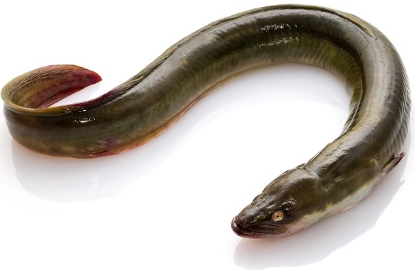
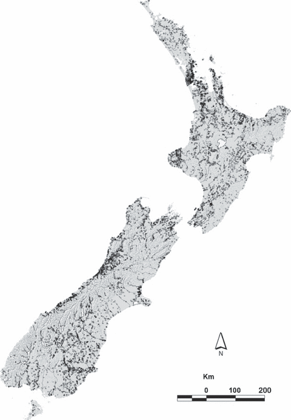

```{r setup, include=FALSE}
library(dplyr)
library(ggplot2)
```

```{r config, include=FALSE}
knitr::opts_chunk$set(
  collapse = TRUE,
  fig.width=7,
  fig.height=3.5,
  out.width="\\textwidth",
  fig.align="center",
  echo=TRUE,
  warning=FALSE
)

ggplot2::theme_set(ggplot2::theme_bw())
```

## Background {.t}

\scriptoutput

Today we'll be looking at data on the presence and absence of the short-finned eel (Anguilla australis) at a number of sites in New Zealand. 

These data come from 

* Leathwick, J. R., Elith, J., Chadderton, W. L., Rowe, D. and Hastie, T. (2008), Dispersal, disturbance and the contrasting biogeographies of New Zealand’s diadromous and non-diadromous fish species. Journal of Biogeography, 35: 1481–1497.

```{r echo=FALSE, fig.align="center", out.width="0.5\\textwidth"}

```

## Species Distribution

```{r echo=FALSE, fig.align="center", out.width="0.5\\textwidth"}

```


## Codebook:

\scriptoutput

* `presence` - presence (`1`) or absence (`0`) of Anguilla australis at the sampling location
* `SegSumT` -	Summer air temperature (degrees C)
* `DSDist` - Distance to coast (km)
* `DSMaxSlope` - Maximum downstream slope (degrees)	
* `USRainDays` - days per month with rain greater than 25 mm
* `USSlope` - average slope in the upstream catchment (degrees)	
* `USNative` - area with indigenous forest (proportion)
* `DSDam` -	Presence of known downstream obstructions, mostly dams
* `Method` -	fishing method (`electric`, `net`, `spot`, `trap`, or `mixture`)
* `LocSed` -	weighted average of proportional cover of bed sediment
    1. mud
    2. sand
    3. fine gravel
    4. coarse gravel
    5. cobble
    6. boulder
    7. bedrock


```{r echo=FALSE}
load("data/anguilla.Rdata")

set.seed(20180130)

part = modelr::resample_partition(anguilla, c(train=0.75, test=0.25))

anguilla = as.data.frame(part$train) %>% tbl_df()
anguilla_test = as.data.frame(part$test) %>% tbl_df()
```

## Data {.t}

\scriptoutput

```{r}
anguilla
```


## EDA

```{r echo=FALSE, warning=FALSE, message=FALSE, fig.height=5}
GGally::ggpairs(
  anguilla %>%
    mutate(
      presence = factor(presence),
      DSDam = factor(DSDam)
    ),
  lower = list(continuous = GGally::wrap("points", alpha=0.05))
)
```


## EDA (part 1)

```{r echo=FALSE, warning=FALSE, message=FALSE, fig.height=5}
GGally::ggpairs(
  anguilla %>%
    mutate(
      presence = factor(presence),
      DSDam = factor(DSDam)
    ) %>%
    select(1:5),
  lower = list(continuous = GGally::wrap("points", alpha=0.05))
)
```

## EDA (part 2)

```{r echo=FALSE, warning=FALSE, message=FALSE, fig.height=5}
GGally::ggpairs(
  anguilla %>%
    mutate(
      presence = factor(presence),
      DSDam = factor(DSDam)
    ) %>%
    select(1,6:10),
  lower = list(continuous = GGally::wrap("points", alpha=0.05))
)
```


## EDA (part 3)

```{r echo=FALSE, warning=FALSE, message=FALSE, fig.height=5}
GGally::ggpairs(
  anguilla %>%
    mutate(
      presence = factor(presence),
      DSDam = factor(DSDam)
    ) %>%
    select(1,2),
  lower = list(continuous = GGally::wrap("points", alpha=0.05))
)
```

# Simple Model

## Model

```{r}
inv_logit = function(x) 1/(1+exp(-x))

g = glm(presence~SegSumT, family=binomial, data=anguilla)
summary(g)
```


## Fit

```{r}
d_g = anguilla %>%
  mutate(p_hat = predict(g, anguilla, type="response"))

d_g_pred = data.frame(SegSumT = seq(11,25,by=0.1)) %>% 
  modelr::add_predictions(g,"p_hat") %>%
  mutate(p_hat = inv_logit(p_hat))
```

```{r echo=FALSE}
ggplot(d_g, aes(x=SegSumT, y=presence)) +
  geom_jitter(height=0.1, alpha=0.5) +
  geom_line(data=d_g_pred, aes(y=p_hat), color="red")
```

## Separation

```{r}
ggplot(d_g, aes(x=p_hat, y=presence, color=as.factor(presence))) +
  geom_jitter(height=0.1, alpha=0.5) +
  labs(color="presence")
```

## Residuals

```{r}
d_g = d_g %>% mutate(resid = presence - p_hat)

ggplot(d_g, aes(x=SegSumT, y=resid)) +
  geom_point(alpha=0.1)
```


## Binned Residuals

```{r}
d_g %>%
  mutate(bin = p_hat - (p_hat %% 0.05)) %>%
  group_by(bin) %>%
  summarize(resid_mean = mean(resid)) %>%
  ggplot(aes(y=resid_mean, x=bin)) +
    geom_point()
```

## Pearson Residuals

$$ r_i = \frac{Y_i - E(Y_i)}{Var(Y_i)} = \frac{Y_i - \hat{p}_i}{\hat{p}_i(1-\hat{p}_i)} $$


```{r}
d_g = d_g %>% mutate(pearson = (presence - p_hat) / (p_hat * (1-p_hat)))
```

```{r echo=FALSE}
ggplot(d_g, aes(x=p_hat, y=pearson)) + geom_point(alpha=0.1)
```

## Binned Pearson Residuals

```{r echo=FALSE}
d_g %>%
  mutate(bin = p_hat - (p_hat %% 0.05)) %>%
  group_by(bin) %>%
  summarize(pearson_mean = mean(pearson)) %>%
  ggplot(aes(y=pearson_mean, x=bin)) +
    geom_point()
```


## Deviance Residuals {.t}

$$ d_i = \text{sign}(Y_i-\hat{p_i}) \sqrt{ -2 \left(Y_i \log \hat{p}_i+(1-Y_i)\log (1 - \hat{p}_i) \right) }  $$

```{r}
d_g = d_g %>%
  mutate(deviance = sign(presence - p_hat) *sqrt(-2 * (presence*log(p_hat) + (1-presence)*log(1 - p_hat) )))
```

```{r echo=FALSE}
ggplot(d_g, aes(x=p_hat, y=deviance)) +
  geom_point(alpha=0.1)   
```

## Binned Deviance Residuals

```{r echo=FALSE}
d_g %>%
  mutate(bin = p_hat - (p_hat %% 0.05)) %>%
  group_by(bin) %>%
  summarize(deviance_mean = mean(deviance)) %>%
  ggplot(aes(y=deviance_mean, x=bin)) +
    geom_point()
```

## Checking Deviance

```{r}
sum(d_g$deviance^2)

glm(presence~SegSumT, family=binomial, data=anguilla)
```

## All together

```{r echo=FALSE, fig.height=5}
d_g %>%
  select(p_hat:deviance) %>%
  mutate(bin = p_hat - (p_hat %% 0.05)) %>%
  tidyr::gather(type, value, -p_hat, -bin) %>%
  mutate(type = forcats::as_factor(type)) %>%
  group_by(bin,type) %>%
  summarize(mean = mean(value)) %>%
  ggplot(aes(x=bin, y=mean, color=type)) +
    geom_point() +
    facet_wrap(~type, ncol=1, scale="free_y")
```

# Full Model 

## Model {.t}

\tinyoutput

```{r}
f = glm(presence~., family=binomial, data=anguilla)
summary(f)
```

```{r echo=FALSE}
d_f = anguilla %>%
  mutate(p_hat = predict(f, anguilla, type="response")) %>%
  mutate(
    resid = presence - p_hat,
    pearson = (presence - p_hat) / (p_hat * (1-p_hat)),
    deviance = sign(presence - p_hat) *sqrt(-2 * (presence*log(p_hat) + (1-presence)*log(1 - p_hat) ))
  ) %>%
  mutate(bin = p_hat - (p_hat %% 0.025))
```

## Separation

```{r echo=FALSE, fig.height=5}
gridExtra::grid.arrange(
  ggplot(d_g, aes(x=p_hat, y=presence, color=as.factor(presence))) +
    geom_jitter(height=0.1, alpha=0.5) +
    labs(color="presence", title="SegSumT Model"),
  ggplot(d_f, aes(x=p_hat, y=presence, color=as.factor(presence))) +
    geom_jitter(height=0.1, alpha=0.5) +
    labs(color="presence", title="Full Model")
)
```

## Residuals vs fitted

```{r echo=FALSE, fig.height=5}
d_f %>%
  select(p_hat:bin) %>%
  tidyr::gather(type, value, -p_hat, -bin) %>%
  group_by(type, bin) %>%
  summarize(mean = mean(value)) %>%
  ggplot(aes(x=bin, y=mean, color=type)) +
    geom_point() +
    facet_wrap(~type, ncol=1, scale="free_y")
```

 


# Model Performance

## Confusion Tables {.t}

```{r echo=FALSE, fig.height=2.5}
ggplot(d_f, aes(x=p_hat, y=presence, color=as.factor(presence))) +
  geom_jitter(height=0.1, alpha=0.5) +
  labs(color="presence", title="Full Model")
```


## Predictive Performance (ROC / AUC)

```{r echo=FALSE, fig.height=5}
res_obs = bind_rows(
  select(d_g, presence, p_hat) %>% mutate(model = "SegSumT Model"),
  select(d_f, presence, p_hat) %>% mutate(model = "Full Model")
)

gg_roc = ggplot(res_obs, aes(d=presence, m=p_hat, color=model)) +
    plotROC::geom_roc(n.cuts=0) +
    plotROC::style_roc()
auc = plotROC::calc_auc(gg_roc)["AUC"]
   
gg_roc +  
  annotate(
    "text", x = .75, y = .25, 
    label = paste("AUC =", round(auc, 3))
  )
```

## Out of sample predictive performance

```{r echo=FALSE, fig.height=5}
full_res = anguilla_test %>% 
  modelr::add_predictions(g,"SegSumT Model") %>%
  modelr::add_predictions(f,"Full Model") %>%
  select(presence, "SegSumT Model","Full Model") %>%
  tidyr::gather(model, p_hat, -presence) %>%
  mutate(p_hat = inv_logit(p_hat)) %>%
  mutate(type = "Test") %>%
  bind_rows(
    res_obs %>% mutate(type = "Train"),
    .
  ) %>%
  mutate(
    model = forcats::as_factor(model),
    type = forcats::as_factor(type)
  )

gg_roc = ggplot(full_res, aes(d=presence, m=p_hat, color=model, linetype=type)) +
    plotROC::geom_roc(n.cuts=0) +
    plotROC::style_roc()

auc = plotROC::calc_auc(gg_roc)["AUC"]
   
gg_roc +  
  annotate(
    "text", x = .75, y = .25, 
    label = paste("AUC =", round(auc, 3))
  )
```


# What about something non-parametric?

## Gradient Boosting Model

```{r message=FALSE}
y = anguilla$presence %>% as.integer()
x = model.matrix(presence~.-1, data=anguilla)
x_test = model.matrix(presence~.-1, data=anguilla_test)

xg = xgboost::xgboost(data=x, label=y, nthead=4, nround=25, 
                      objective="binary:logistic", verbose = FALSE)
```

```{r echo=FALSE}
d_xg = anguilla %>% mutate(p_hat = predict(xg, newdata=x)) 

d_xg_test = anguilla_test %>% mutate(p_hat = predict(xg, newdata=x_test))
```

```{r echo=FALSE, fig.height=2}
imp = xgboost::xgb.importance(colnames(x), model=xg)
xgboost::xgb.plot.importance(imp, rel_to_first = TRUE, xlab = "Relative importance")
```

## Residuals?

```{r echo=FALSE}
d_xg %>%
  mutate(
    resid = presence - p_hat,
    pearson = (presence - p_hat)/(p_hat*(1-p_hat)),
    deviance = sign(presence-p_hat) * sqrt(-2 * (presence * log(p_hat) + (1-presence) * log(1-p_hat)))
  ) %>%
  select(p_hat:deviance) %>%
  mutate(bin = p_hat - (p_hat %% 0.05)) %>%
  tidyr::gather(type, value, -p_hat, -bin) %>%
  mutate(type = forcats::as_factor(type)) %>%
  group_by(type, bin) %>%
  summarize(mean = mean(value)) %>%
  ggplot(aes(x=bin, y=mean, color=type)) +
  geom_point() +
  facet_wrap(~type, ncol=3, scale="free_y")
```

## Separation?

```{r echo=FALSE, fig.height=5}
ggplot(d_xg, aes(x=p_hat, y=presence, color=as.factor(presence))) +
  geom_jitter(height=0.1, alpha=0.5) +
  labs(color="presence")
```

## Effect of `nround` - Training Data

```{r echo=FALSE, message=FALSE}
get_xg = function(nrounds = 25)
  xgboost::xgboost(data=x, label=y, nthead=4, nround=nrounds, objective="binary:logistic", verbose=FALSE)

xg_5  = get_xg(5)
xg_10 = get_xg(10)
xg_15 = get_xg(15)

d_xg_5  = anguilla %>% mutate(p_hat = predict(xg_5, newdata=x))
d_xg_10 = anguilla %>% mutate(p_hat = predict(xg_10, newdata=x))
d_xg_15 = anguilla %>% mutate(p_hat = predict(xg_15, newdata=x))

d_xg_5_test  = anguilla_test %>% mutate(p_hat = predict(xg_5, newdata=x_test))
d_xg_10_test = anguilla_test %>% mutate(p_hat = predict(xg_10, newdata=x_test))
d_xg_15_test = anguilla_test %>% mutate(p_hat = predict(xg_15, newdata=x_test))
```

```{r echo=FALSE, fig.height=5}
gridExtra::grid.arrange(
  ggplot(d_xg_5, aes(x=p_hat, y=presence, color=as.factor(presence))) +
    geom_jitter(height=0.1, alpha=0.5) +
    labs(color="presence", title="XGBoost - 5 rounds - Training Data"),
  ggplot(d_xg_10, aes(x=p_hat, y=presence, color=as.factor(presence))) +
    geom_jitter(height=0.1, alpha=0.5) +
    labs(color="presence", title="XGBoost - 10 rounds - Training Data"),
  ggplot(d_xg_15, aes(x=p_hat, y=presence, color=as.factor(presence))) +
    geom_jitter(height=0.1, alpha=0.5) +
    labs(color="presence", title="XGBoost - 15 rounds - Training Data"),
  ggplot(d_xg, aes(x=p_hat, y=presence, color=as.factor(presence))) +
    geom_jitter(height=0.1, alpha=0.5) +
    labs(color="presence", title="XGBoost - 25 rounds - Training Data")
)
```

## Effect of `nround` - Test Data

```{r echo=FALSE, fig.height=5}
gridExtra::grid.arrange(
  ggplot(d_xg_5_test, aes(x=p_hat, y=presence, color=as.factor(presence))) +
    geom_jitter(height=0.1, alpha=0.5) +
    labs(color="presence", title="XGBoost - 5 rounds - Test Data"),
  ggplot(d_xg_10_test, aes(x=p_hat, y=presence, color=as.factor(presence))) +
    geom_jitter(height=0.1, alpha=0.5) +
    labs(color="presence", title="XGBoost - 10 rounds - Test Data"),
  ggplot(d_xg_15_test, aes(x=p_hat, y=presence, color=as.factor(presence))) +
    geom_jitter(height=0.1, alpha=0.5) +
    labs(color="presence", title="XGBoost - 15 rounds - Test Data"),
  ggplot(d_xg_test, aes(x=p_hat, y=presence, color=as.factor(presence))) +
    geom_jitter(height=0.1, alpha=0.5) +
    labs(color="presence", title="XGBoost - 25 rounds - Test Data")
)
```

## ROC Curves

```{r echo=FALSE, fig.height=5}
bind_rows(
  full_res,
  d_xg_5  %>% mutate(type="Train", model="XGBoost - 5 rounds"),
  d_xg_10 %>% mutate(type="Train", model="XGBoost - 10 rounds"),
  d_xg_15 %>% mutate(type="Train", model="XGBoost - 15 rounds"),
  d_xg    %>% mutate(type="Train", model="XGBoost - 25 rounds"),
  d_xg_5_test  %>% mutate(type="Test", model="XGBoost - 5 rounds"),
  d_xg_10_test %>% mutate(type="Test", model="XGBoost - 10 rounds"),
  d_xg_15_test %>% mutate(type="Test", model="XGBoost - 15 rounds"),
  d_xg_test    %>% mutate(type="Test", model="XGBoost - 25 rounds")
) %>%
  select(presence, p_hat, type, model) %>%
  mutate(
    model = forcats::as_factor(model),
    type = forcats::as_factor(type)
  ) %>%
  ggplot(aes(d=presence, m=p_hat, color=model, linetype=type)) +
    plotROC::geom_roc(n.cuts = 0) +
    plotROC::style_roc()
```

## ROC Curves (test only)

```{r echo=FALSE, fig.height=5}
gg_roc = bind_rows(
  d_xg_5_test  %>% mutate(type="Test", model="XGBoost - 5 rounds"),
  d_xg_10_test %>% mutate(type="Test", model="XGBoost - 10 rounds"),
  d_xg_15_test %>% mutate(type="Test", model="XGBoost - 15 rounds"),
  d_xg_test    %>% mutate(type="Test", model="XGBoost - 25 rounds")
) %>%
  select(presence, p_hat, type, model) %>%
  mutate(
    model = forcats::as_factor(model),
    type = forcats::as_factor(type)
  ) %>%
  ggplot(aes(d=presence, m=p_hat, color=model)) +
    plotROC::geom_roc(n.cuts = 0, linetype="dashed") +
    plotROC::style_roc()

auc = plotROC::calc_auc(gg_roc)["AUC"]
   
gg_roc +  
  annotate(
    "text", x = .75, y = .25, 
    label = paste("AUC =", round(auc, 3))
  )
```

# Aside: Species Distribution Modeling

## Model Choice {.t}

We have been fitting a model that looks like the following,

$$
\begin{aligned}
y_i &\sim \text{Bern}(p_i) \\
\text{logit}(p_i) &= \symbf{X}_{i\cdot} \symbf{\beta} 
\end{aligned}
$$

Interpretation of $y_i$ and $p_i$?


## Absence of evidence ... {.t}

If we observe a species at a particular location what does that tell us?

\vspace{3cm} \pause

If we *don't* observe a species at a particular location what does that tell us?


## Revised Model {.t}

If we allow for crypsis, then

$$
\begin{aligned}
y_i &\sim \text{Bern}(q_i\,z_i) \\
z_i &\sim \text{Bern}(p_i) \\
\text{logit}(q_i) &= \symbf{X}_{i\cdot} \symbf{\gamma} \\
\text{logit}(p_i) &= \symbf{X}_{i\cdot} \symbf{\beta}
\end{aligned}
$$

Interpretation of $y_i$, $z_i$, $p_i$, and $q_i$?